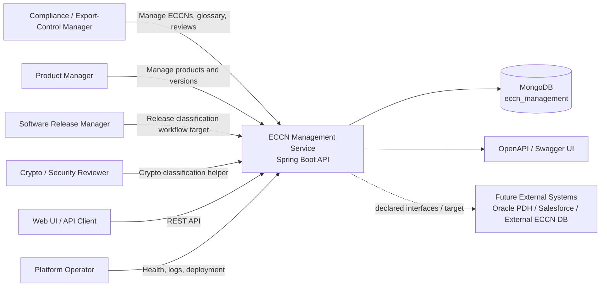
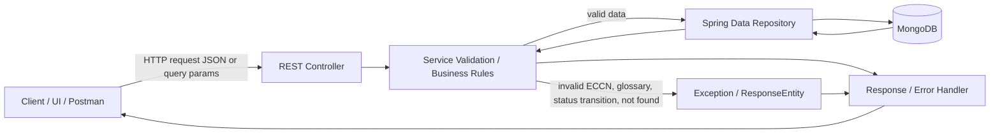
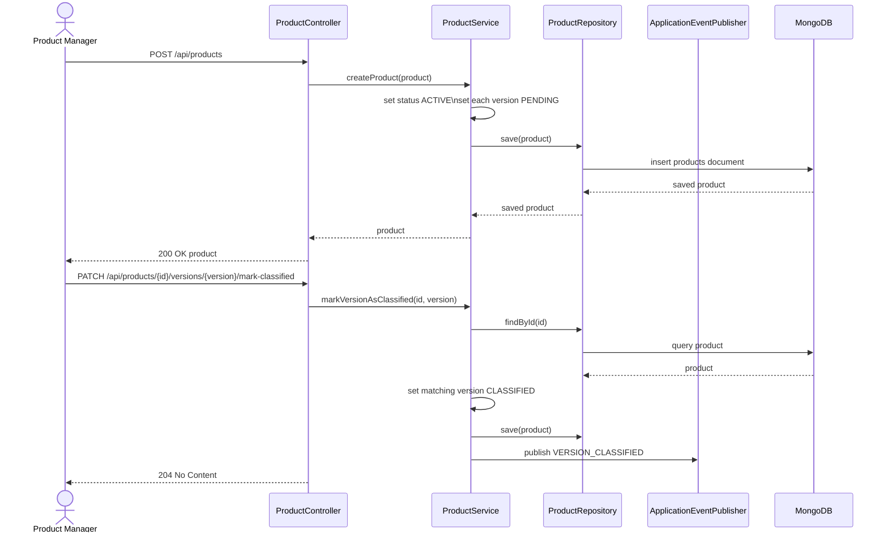
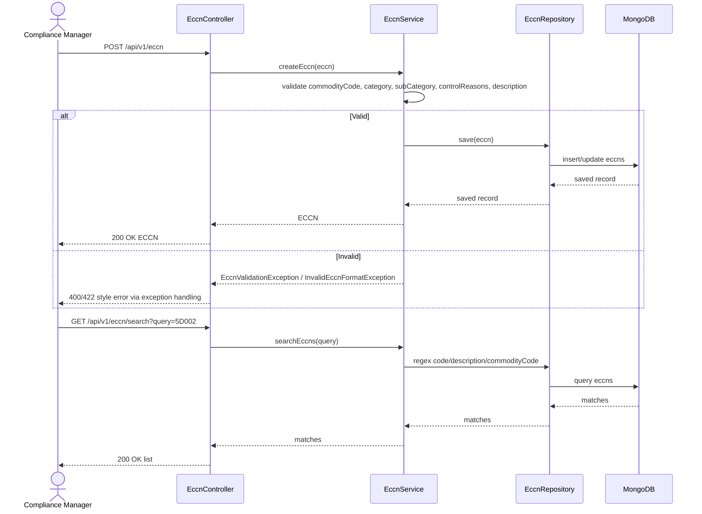

# ECCN Management Service — Product Requirements Document

## Document Metadata

- **Product/System**: ECCN Management Service
- **Source**: Reverse-engineered from repository source, tests, README, Postman collection, and Docker/Compose.
- **Date**: 2026-07-08
- **Status**: Reverse-engineered current-state PRD with target-state recommendations
- **Primary evidence**: `README.md`, `pom.xml`, `src/main/java/com/aciworldwide/eccn_management_service`, `src/test/java/com/aciworldwide/eccn_management_service`, `postman/ECCN-Management.postman_collection.json`, `compose.yaml`, `Dockerfile`

---

## 1. Executive Summary

### Problem Statement

Export-control stakeholders need a centralized service to manage Export Control Classification Numbers (ECCNs), product/version classification status, cryptographic classification decisions, compliance glossary terminology, and related operational evidence. The current codebase implements part of this vision as a Spring Boot/MongoDB service, but several documented capabilities exist only as service-layer code, tests, Postman placeholders, or deployment manifests rather than complete public APIs.

### Proposed Solution

Maintain and evolve the ECCN Management Service as a compliance platform API that supports ECCN record management, product portfolio classification tracking, crypto classification assistance, glossary administration, and future expansion into document records, risk assessments, export controls, and workflow automation. Harden the platform for production with explicit authentication/authorization, secure configuration, operational observability, and deployment readiness.

### Success Criteria

1. **ECCN data management**: Compliance users can create, search, update, filter, deprecate, and delete ECCN records with validation enforcing valid ECCN format, category, subcategory, control reasons, and description quality.
2. **Product classification tracking**: Product and release users can create product records, track version-level classification status, and identify all pending classifications.
3. **Classification assistance**: Crypto reviewers can obtain deterministic ECCN guidance for supported algorithms and key lengths, including `5D992`, `5D002`, and `Not classified` outcomes.
4. **Compliance reference data**: Users can manage glossary entries, bulk import terms, search definitions, and identify stale glossary content.
5. **Production readiness**: The service must compile, pass automated tests, protect sensitive endpoints/data, avoid committed credentials in production, and expose health/metrics safely.

---

## 2. User Experience & Functionality

### User Personas

| Persona | Responsibilities | Primary Needs |
|---|---|---|
| Compliance / Export-Control Manager | Owns ECCN records, classifications, export-control decisions, and compliance evidence | Validated ECCN CRUD, classification review, glossary governance, audit-ready records |
| Product Manager | Manages product portfolio and product metadata required for classification | Product/version tracking, pending-classification visibility, classification status updates |
| Software Release Manager | Coordinates release changes that may require classification or reclassification | Release data capture, handoff to product/compliance teams, workflow traceability |
| Crypto / Security Reviewer | Evaluates encryption functionality and crypto libraries | Classification guidance by algorithm, key length, mode, library, and mass-market criteria |
| Platform Operator / Administrator | Operates the service in local and containerized (Docker) environments | Secure configuration, health checks, OpenAPI docs, logs, safe deployments |
| Frontend Client / Integrator | Consumes API from UI or automation | Stable REST endpoints, OpenAPI documentation, CORS support, predictable error responses |

### Current Implemented Capabilities

#### ECCN Management

The service exposes `/api/v1/eccn` for ECCN CRUD and search.

- List all ECCNs with optional `category` and `controlReason` filters.
- Retrieve an ECCN by MongoDB id.
- Create validated ECCN records.
- Search ECCNs by code, description, or commodity code.
- Update/replace an ECCN by id.
- Delete an existing ECCN by id.

Key validation rules:

- `commodityCode` must match five uppercase alphanumeric characters, for example `5D002`.
- `category` must be `0` through `9`.
- `subCategory` must be one of `A`, `B`, `C`, `D`, or `E`.
- `controlReasons` must include at least one of `NS`, `MT`, `NP`, `CB`, `AT`, `CC`, `RS`, `SI`, `SL`, or `UN`.
- `description` must be 10–1000 characters.

#### Product Portfolio

The service exposes `/api/products` for product/version classification tracking.

- Create products; created products default to `ACTIVE`.
- Created product versions default to `PENDING` classification.
- Update product data while preserving existing version classification statuses for matching version numbers.
- Search products by status or name.
- List products with versions pending classification.
- Mark a product version as `CLASSIFIED`.

#### Crypto Classification

The service exposes `/api/crypto-classification/classify`.

- Accepts `keyLength`, `algorithm`, and optional `isMassMarket` request parameters.
- Supported algorithms: `AES`, `RSA`, `ECC`, `BLOWFISH`, `SHA3`.
- Returns deterministic string outcomes:
  - `ECCN 5D992` for qualifying mass-market/non-restricted cryptography with key length `<=128`.
  - `ECCN 5D002` for restricted algorithm or key length `>128`.
  - `Not classified` for null/invalid algorithm or key length `<64`.

#### Glossary Management

The service exposes `/api/v1/glossary`.

- Create, update, retrieve, and delete glossary entries.
- Retrieve by exact term, category, cross-reference, or id.
- Search by term, definition, or regulatory context.
- Bulk import entries.
- Identify entries needing update based on `lastUpdated` string comparison.
- Seed loader initializes common BIS/export-control terms when repository is empty.

Valid categories:

- `Export Controls`
- `Cryptography`
- `Hardware`
- `Software`
- `Technology`
- `General`

#### Health and Documentation

- Custom health endpoint: `GET /api/health` returns `OK`.
- Actuator dependency is present and configured.
- OpenAPI/Swagger UI is configured at `/swagger-ui.html` and `/v3/api-docs`.

### Current Service-Layer Capabilities Not Fully Exposed by REST

The codebase contains service/model logic for the following capabilities, but public controllers are absent or incomplete:

- Document records, versions, document diffing, related-document links, expiration archiving, and audit trail.
- Risk assessment records with scoring, risk levels, follow-up flags, mitigation actions, and review scheduling.
- Export control records with jurisdiction classification conflicts, unified classification, compliance requirements, and special handling.
- ECCN classification workflow state machine for software release manager, product manager, compliance manager, and automated system roles.
- Automated classification history, AI model integration hooks, source/package analysis stubs, and classification change alerts.
- External ECCN validation and enterprise integrations for Oracle PDH / Salesforce-style systems are declared as interfaces but have no implementation.

### User Stories and Acceptance Criteria

#### Story 1 — Manage ECCN Records

**As a compliance manager**, I want to manage ECCN records so that product classifications are consistently tracked and searchable.

Acceptance criteria:

- Given a valid ECCN payload, `POST /api/v1/eccn` persists and returns the ECCN record.
- Given an invalid `commodityCode`, category, subcategory, control reason, or description, the API returns a validation error and does not persist the record.
- `GET /api/v1/eccn/search?query=<term>` returns records matching code, commodity code, or description.
- `GET /api/v1/eccn?category=5` returns only category `5` records.
- `GET /api/v1/eccn?controlReason=NS` returns records containing control reason `NS`.
- Deleting a non-existent ECCN returns a clear error rather than silently succeeding.

#### Story 2 — Track Product Version Classification

**As a product manager**, I want product versions to start as pending classification so that compliance work is visible before release.

Acceptance criteria:

- When a product is created, its `status` is set to `ACTIVE`.
- When a product has versions, each version starts with `classificationStatus=PENDING`.
- `GET /api/products/pending-classification` returns products with at least one pending version.
- `PATCH /api/products/{productId}/versions/{versionNumber}/mark-classified` marks the matching version `CLASSIFIED`.
- Updating a product preserves classification statuses for version numbers that already exist.

#### Story 3 — Classify Cryptographic Functionality

**As a crypto reviewer**, I want a deterministic classification helper so that common encryption cases can be triaged quickly.

Acceptance criteria:

- `POST /api/crypto-classification/classify?keyLength=128&algorithm=AES` returns `ECCN 5D992`.
- `POST /api/crypto-classification/classify?keyLength=256&algorithm=ECC` returns `ECCN 5D002`.
- `SHA3` is treated as restricted and classified as `ECCN 5D002`.
- Key lengths below `64` return `Not classified`.
- Unsupported algorithm inputs return a predictable client error rather than an unhandled server error.

#### Story 4 — Maintain Compliance Glossary

**As a compliance analyst**, I want to manage glossary terms so that teams use consistent export-control language.

Acceptance criteria:

- Users can create entries with required `term` and `definition`.
- Duplicate terms are rejected.
- Invalid categories are rejected.
- Users can search by term fragment, definition text, regulatory context, and cross-reference.
- Bulk import succeeds only when all entries pass validation.
- The seed loader initializes common glossary terms only when the repository is empty.

#### Story 5 — Manage Compliance Documentation *(Target / Partially Implemented)*

**As a compliance manager**, I want document records and versions linked to modules and ECCNs so that classification evidence is audit-ready.

Acceptance criteria:

- Users can create document records with type, name, module, ECCN classification, storage location, creator, and expiration date.
- Users can create and list document versions in descending version order.
- Users can compare two versions and receive a line-by-line diff.
- Users can link related documents with relationship types.
- Expired documents can be archived and archived records can be deleted according to retention policy.

#### Story 6 — Assess Export-Control Risk *(Target / Partially Implemented)*

**As a compliance manager**, I want risk assessments to score restricted end uses, high-risk users, and third-party components so that high-risk items receive follow-up.

Acceptance criteria:

- Risk score equals `restrictedEndUses * 10 + highRiskUsers * 5 + thirdPartyComponents * 3`.
- `LOW` risk is score `<=10`, `MEDIUM` risk is score `<=30`, and `HIGH` risk is score `>30`.
- New assessments default `assessmentDate` to today and `nextReviewDate` to six months later.
- Users can search assessments by module, risk level, end use, user, third-party component, assessor, review due date, and follow-up flag.
- Users can update mitigation actions and next review date.

#### Story 7 — Coordinate Classification Workflow *(Target / Partially Implemented)*

**As a release manager**, I want releases to flow through product and compliance review so that classification decisions are traceable.

Acceptance criteria:

- Workflow supports release planning, release data gathering, draft, product information gathering, product manager validation, compliance review, clarification, automated classification, compliance approval, report generation, and completion.
- Invalid status transitions are rejected.
- Product data validation requires technical specs, intended use, features, market segment, development status, and crypto details when cryptography is present.
- Release data validation requires version, planned release date, change log, modified components, and crypto-change details when cryptography changed.
- Workflow history records timestamp, role, action, and status transition context.

### Non-Goals

- The service is not currently a complete identity provider or OAuth authorization server.
- The service does not currently implement full legal/regulatory adjudication of ECCN decisions; deterministic rules and stubs require expert review before regulatory reliance.
- The current implementation does not provide a frontend UI.
- The current implementation does not provide completed REST APIs for all service-layer capabilities.
- The current implementation does not provide database migrations, production secret management, or complete Kubernetes operational hardening.

---

## 3. AI System Requirements

### Applicability

The current codebase includes an `AutomatedClassificationToolService.AIModel` interface for classification suggestions, but no concrete AI model implementation is present. Automated source/package analysis methods are currently stubs that return empty encryption libraries and no payment-processing signal.

### Tool Requirements

Target AI-assisted classification should support:

- Source repository analysis for cryptographic libraries, algorithms, key lengths, weak modes, and payment-processing functionality.
- Package/dependency analysis for known crypto libraries and versions.
- Confidence-scored ECCN suggestions.
- Rationale generation explaining detected evidence and classification basis.
- Comparison with prior analysis history to detect classification changes.
- Human compliance approval before final classification.

### Evaluation Strategy

Before AI-assisted classification can be considered production-ready:

- Build a benchmark set of representative modules/packages with expert-approved expected classifications.
- Measure classification accuracy and rationale correctness against expert labels.
- Require source citations or evidence snippets for every suggested classification.
- Track false positives and false negatives separately for `5D002`, `5D992`, and `EAR99`-style outcomes.
- Require human-in-the-loop review for all high-risk or low-confidence classifications.

### AI Non-Goals

- AI output must not automatically become a final ECCN decision without product/compliance approval.
- AI must not override explicit compliance manager decisions.
- AI must not store or transmit proprietary source code outside approved enterprise boundaries.

---

## 4. Technical Specifications

### Architecture Overview

The current implementation is a Spring Boot service backed by MongoDB. It exposes REST controllers for ECCN, products, crypto classification, glossary, and health. Additional domain services exist for document records, risk assessment, export controls, automated classification, integrations, and workflow state management.

#### System Context

Design rationale:

- REST API is the main interaction boundary.
- MongoDB is the only concrete datastore.
- External enterprise integrations are declared but not implemented.
- Frontend usage is implied by CORS configuration.

#### Container / Component Architecture

```mermaid
flowchart TB
    subgraph API[REST Controllers]
        EccnController[EccnController\n/api/v1/eccn]
        ProductController[ProductController\n/api/products]
        CryptoController[CryptoClassificationController\n/api/crypto-classification]
        GlossaryController[GlossaryController\n/api/v1/glossary]
        HealthController[HealthController\n/api/health]
    end

    subgraph Services[Domain Services]
        EccnService[EccnService]
        ProductService[ProductService]
        CryptoService[CryptoClassificationService]
        GlossaryService[GlossaryService]
        DocumentService[DocumentRecordService\nnot exposed by REST]
        RiskService[RiskAssessmentService\nnot exposed by REST]
        ExportService[ExportControlService\nnot exposed by REST]
        WorkflowService[EccnClassificationWorkflowService\nin-memory workflow]
        AutoClassService[AutomatedClassificationToolService\nstubbed analysis / AI hook]
    end

    subgraph Data[Mongo Repositories]
        EccnRepo[EccnRepository]
        ProductRepo[ProductRepository]
        GlossaryRepo[GlossaryEntryRepository]
        DocRepo[DocumentRecordRepository]
        VersionRepo[DocumentVersionRepository]
        RiskRepo[RiskAssessmentRepository]
        ExportRepo[ExportControlRepository]
        HistoryRepo[ClassificationHistoryRepository]
    end

    Mongo[(MongoDB)]

    EccnController --> EccnService --> EccnRepo --> Mongo
    ProductController --> ProductService --> ProductRepo --> Mongo
    CryptoController --> CryptoService
    GlossaryController --> GlossaryService --> GlossaryRepo --> Mongo
    DocumentService --> DocRepo --> Mongo
    DocumentService --> VersionRepo --> Mongo
    RiskService --> RiskRepo --> Mongo
    ExportService --> ExportRepo --> Mongo
    AutoClassService --> HistoryRepo --> Mongo
    AutoClassService --> CryptoService
    HealthController --> HealthController
```

Design rationale:

- Controllers are thin and delegate to services.
- Services own validation, status transitions, classification rules, and event publication.
- Repositories use Spring Data MongoDB derived queries plus selected regex queries.
- Several services represent target capabilities that need controller/API completion.

#### Data Flow

Validation points:

- ECCN format/category/subcategory/control reasons/description are validated before save.
- Glossary term, definition, category, and duplicates are validated before save/import.
- Product creation assumes versions exist and sets classification status.
- Workflow service enforces status transitions in memory.
- Crypto classification validates only enough to choose deterministic output; unsupported algorithms can currently throw enum conversion errors.

#### Key Sequence — Product Classification Tracking

#### Key Sequence — ECCN Create/Search

### Data Model Summary

| Entity | Collection | Key Fields | Notes |
|---|---|---|---|
| `Eccn` | `eccns` | `commodityCode`, `code`, `category`, `subCategory`, `controlReasons`, `description`, deprecation fields | `commodityCode` is required by validation; `code` also exists and is searched. |
| `Product` | `products` | `name`, `description`, `features`, embedded `versions`, `status`, crypto/export flags | Versions include `versionNumber`, `releaseDate`, `encryptionLibraries`, `classificationStatus`. |
| `GlossaryEntry` | `glossary_entries` | `term`, `definition`, `category`, `regulatoryContext`, `crossReferences`, `lastUpdated` | Duplicate checks are service-level only. |
| `DocumentRecord` | `document_records` | `documentType`, `documentName`, `storageLocation`, `associatedModule`, `eccnClassification`, `expirationDate`, `archived` | Implemented service, no controller. |
| `DocumentVersion` | default collection | `document`, `content`, `versionNumber`, `createdDate`, `createdBy` | DBRef to `DocumentRecord`. |
| `RiskAssessment` | `risk_assessments` | `moduleName`, restricted uses/users/components, `riskScore`, `riskLevel`, review dates | Implemented service, no controller. |
| `ExportControl` | `export_controls` | `moduleName`, `earClassification`, jurisdiction classifications, conflicts, requirements | Implemented service, no controller. |
| `ModuleAnalysis` | classification history repository | module, encryption libraries, payment processing, ECCN, rationale | Inner class without explicit `@Document`/`@Id`; persistence needs validation. |

### Integration Points

#### Implemented / Configured

- MongoDB via Spring Data MongoDB.
- OpenAPI documentation via Springdoc.
- Spring Boot Actuator.
- CORS for `localhost:3000` and `eccn-management-ui:3000`.
- Application event publication for product version updates/classification.
- Resilience4j circuit breaker annotation on ECCN history lookup.

#### Declared / Target

- External ECCN validation database.
- Oracle PDH synchronization.
- Salesforce CPQ/CRM publication and mapping.
- AI classification model integration.
- Multi-service deployment contexts for product portfolio, classification, risk assessment, and compliance operations.

### Security & Privacy Requirements

Current risks require production remediation:

- Hard-coded local credentials exist for MongoDB and Spring Security defaults.
- Actuator is configured to expose all endpoints and always show health details.
- Spring Security dependency is present, but no explicit endpoint authorization policy was found.
- Postman references bearer-token auth, but no local OAuth/JWT implementation was found.
- Kubernetes manifests use a MongoDB Secret for URI, but do not define pod/container hardening.

Target requirements:

- Replace committed/default credentials with environment-specific secrets.
- Define explicit `SecurityFilterChain` with endpoint-level authorization.
- Support bearer JWT/OAuth2 or enterprise SSO if required by deployment environment.
- Protect or restrict actuator endpoints; expose only required health/metrics externally.
- Require TLS in deployed environments.
- Add audit logs for create/update/delete/classification actions.
- Avoid logging sensitive classification evidence or proprietary source code.
- Add role-based access for compliance manager, product manager, crypto reviewer, operator, and read-only users.

### Non-Functional Requirements

#### Scalability

- API service should support horizontal scaling.
- State must remain externalized in MongoDB and not rely on in-memory workflow state for durable classification processes.
- Add MongoDB indexes for high-volume queries, especially ECCN search, glossary term/category, product version classification status, and risk review dates.

#### Performance

- Search endpoints should avoid unbounded collection scans at production scale.
- Regex search should be replaced or augmented with indexed text search where appropriate.
- Cache frequently read reference data such as glossary terms and ECCN lookup tables when cache is enabled.
- Classification and source/package analysis should run asynchronously for long-running operations.

#### Reliability

- Add liveness/readiness/startup probes in Kubernetes manifests.
- Define retries/timeouts/circuit-breaker properties for external integrations.
- Define backup/restore strategy for MongoDB.
- Fix compile/test issues before production readiness.
- Ensure product update and classification operations fail clearly when product/version is not found.

#### Maintainability

- Align README, Postman, OpenAPI docs, code, and deployment manifests.
- Add controllers or explicitly remove unused services for partially implemented capabilities.
- Resolve duplicated/stale config references, including Hystrix vs Resilience4j and Java 17 README vs Java 21 build.
- Add integration tests for MongoDB queries and controller behavior.
- Use typed DTOs instead of exposing persistence entities directly for public APIs.

#### Observability

- Add structured JSON logging with correlation/request IDs.
- Add metrics dashboards and alerts for error rate, latency, DB health, classification throughput, and pending classifications.
- Limit health detail exposure by environment.
- Add audit trails for compliance-sensitive actions.

### Current Technical Gaps / Risks

1. The workspace was reported by subagent analysis as failing compile validation because of missing generated/accessor methods and repository/service mismatches.
2. `EccnRepository.findEccnHistory` is referenced but not declared in the inspected repository.
3. `Eccn.code` and `Eccn.commodityCode` coexist; create/update validation uses `commodityCode` while search includes both.
4. `POST /api/products` assumes `versions` is non-null.
5. Product `PATCH` endpoint may be blocked by browser CORS because PATCH is not in allowed methods.
6. Postman documents endpoints that do not exist locally, including `GET /api/products/{productId}`, `/api/classifications`, `/api/risk-assessments`, and `/api/compliance-records`.
7. Document/risk/export-control/workflow services are not exposed by REST.
8. Local and compose credentials are hard-coded.
9. Actuator exposure is too broad for production.
10. Dockerfile skips tests, uses a full JDK runtime, and runs without explicit non-root user.
11. Kubernetes manifests lack probes, HPA, PDB, ingress, network policy, and pod/container security context.

---

## 5. Risks & Roadmap

### Phased Rollout

#### Phase 0 — Stabilize Current Codebase

Goals:

- Restore clean compile and test execution.
- Align Lombok/annotation processing and repository methods.
- Fix obvious API/runtime mismatches.
- Document current supported endpoints accurately.

Candidate acceptance criteria:

- `./mvnw test` passes locally.
- OpenAPI output generates successfully.
- README and Postman collection match implemented endpoints or clearly mark target/future APIs.
- CORS supports all implemented browser-consumed methods, including PATCH if retained.

#### Phase 1 — MVP Production API

Goals:

- Complete and harden existing REST capabilities for ECCN, products, crypto classification, glossary, health, and OpenAPI.
- Add explicit security configuration.
- Add controller tests and integration tests with Testcontainers MongoDB.

Candidate acceptance criteria:

- Role-based endpoint access is defined and tested.
- Invalid API inputs return structured 4xx responses.
- MongoDB indexes exist for primary query paths.
- No production secrets are committed in application config.
- Actuator exposure is environment-safe.

#### Phase 2 — Compliance Evidence Expansion

Goals:

- Expose document records/versioning APIs.
- Expose risk assessment APIs.
- Expose export control APIs.
- Add durable audit trails.

Candidate acceptance criteria:

- Document version creation updates record-version relationships consistently.
- Risk scoring and review scheduling are exposed and tested.
- Export control conflict handling is domain-correct and not just lexicographic.
- Audit logs capture actor, timestamp, operation, before/after summary, and correlation ID.

#### Phase 3 — Workflow and Automation

Goals:

- Persist the ECCN classification workflow.
- Add workflow APIs for release manager, product manager, compliance manager, and automated classification roles.
- Integrate AI/source/package classification with human approval.
- Implement external validation and enterprise integrations.

Candidate acceptance criteria:

- Workflow survives service restarts.
- Every workflow transition is validated, audited, and authorized.
- AI suggestions include confidence and evidence.
- External integration failures are retried, observable, and do not corrupt core data.

#### Phase 4 — Platform Hardening

Goals:

- Production-grade container and Docker-based deployment.
- Observability, SLOs, backup/restore, and security hardening.

Candidate acceptance criteria:

- Images run as non-root and pass vulnerability scans.
- Deployments include container health checks, resource limits, restart policies, and secure secret injection.
- Dashboards and alerts exist for service health, latency, errors, MongoDB connectivity, and pending classification backlog.
- Backup and restore procedures are documented and tested.

### Technical Risks

| Risk | Impact | Mitigation |
|---|---|---|
| Current code may not compile cleanly | Blocks delivery and validation | Fix compile errors before feature expansion; enforce CI build. |
| Security model incomplete | Compliance data exposure | Add explicit Spring Security config, authN/authZ, secret management, and actuator restrictions. |
| Partial services without controllers | Product expectations exceed delivered API | Prioritize APIs or remove/mark target-only capabilities in docs. |
| Regex search without indexes | Poor performance at scale | Add indexes/text search and query performance tests. |
| No durable workflow persistence | Lost classification workflow state | Persist workflow requests and history before production workflow use. |
| AI classification stubs | False sense of automation | Label as non-production until model/evaluation/human approval are implemented. |
| Config/documentation drift | Operator/client confusion | Synchronize README, Postman, OpenAPI, manifests, and code in CI. |
| Hard-coded credentials | Security incident risk | Move secrets to environment/secret manager; rotate defaults. |

### Open Questions

1. What enterprise identity provider should be used: basic auth, OAuth2/OIDC, Keycloak, Azure AD, or another SSO provider?
2. Which capabilities are in MVP scope: only currently exposed APIs, or also document/risk/export-control/workflow APIs?
3. **Resolved (2026-07-20)**: deployment is a single modular service with Docker-exclusive deployment; the former Rancher manifests implying four bounded-context services were removed.
4. What compliance audit retention requirements apply to ECCN records, document versions, classification decisions, and risk assessments?
5. Which external systems must be integrated first: Oracle PDH, Salesforce, external ECCN validation database, or none for MVP?
6. What are the required roles and permissions for compliance managers, product managers, release managers, crypto reviewers, operators, and read-only auditors?
7. What performance targets apply for search, classification, and pending-classification dashboards?

### Recommended Next Steps

1. Run and fix `./mvnw test` until the project compiles and all existing tests pass.
2. Decide MVP scope and mark non-MVP services as future capabilities in README/OpenAPI/Postman.
3. Add explicit security configuration and remove hard-coded production-risk credentials.
4. Add missing controller/API coverage for chosen MVP capabilities.
5. Add Testcontainers-backed controller/repository integration tests.
6. Add deployment hardening: probes, non-root image, safe actuator, secret injection, and environment profiles.
7. Convert this PRD into implementation epics and acceptance-tested user stories.
